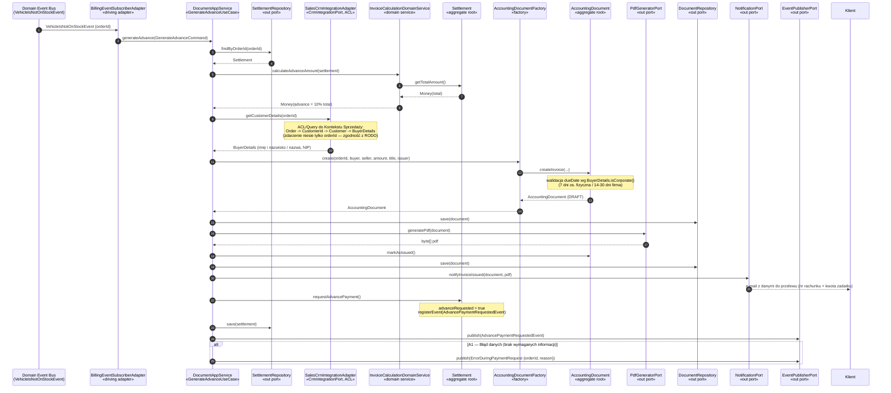

```mermaid
sequenceDiagram
    autonumber
    participant Bus as Domain Event Bus<br/>(VehicleIsNotOnStockEvent)
    participant Sub as BillingEventSubscriberAdapter<br/>«driving adapter»
    participant App as DocumentAppService<br/>«GenerateAdvanceUseCase»
    participant SRepo as SettlementRepository<br/>«out port»
    participant Crm as SalesCrmIntegrationAdapter<br/>«CrmIntegrationPort, ACL»
    participant Calc as InvoiceCalculationDomainService<br/>«domain service»
    participant Stl as Settlement<br/>«aggregate root»
    participant Fac as AccountingDocumentFactory<br/>«factory»
    participant Doc as AccountingDocument<br/>«aggregate root»
    participant Pdf as PdfGeneratorPort<br/>«out port»
    participant DRepo as DocumentRepository<br/>«out port»
    participant Notif as NotificationPort<br/>«out port»
    participant Pub as EventPublisherPort<br/>«out port»
    participant Klient

    Bus->>Sub: VehicleIsNotOnStockEvent {orderId}
    Sub->>App: generateAdvance(GenerateAdvanceCommand)

    App->>SRepo: findByOrderId(orderId)
    SRepo-->>App: Settlement

    App->>Calc: calculateAdvanceAmount(settlement)
    Calc->>Stl: getTotalAmount()
    Stl-->>Calc: Money(total)
    Calc-->>App: Money(advance = 10% total)

    App->>Crm: getCustomerDetails(orderId)
    Note over Crm: ACL/Query do Kontekstu Sprzedaży:<br/>Order -> CustomerId -> Customer -> BuyerDetails<br/>(zdarzenie niesie tylko orderId — zgodność z RODO)
    Crm-->>App: BuyerDetails (imię i nazwisko / nazwa, NIP)

    App->>Fac: create(orderId, buyer, seller, amount, title, issuer)
    Fac->>Doc: createInvoice(...)
    Note over Doc: walidacja dueDate wg BuyerDetails.isCorporate()<br/>(7 dni os. fizyczna / 14-30 dni firma)
    Doc-->>Fac: AccountingDocument (DRAFT)
    Fac-->>App: AccountingDocument

    App->>DRepo: save(document)
    App->>Pdf: generatePdf(document)
    Pdf-->>App: byte[] pdf
    App->>Doc: markAsIssued()
    App->>DRepo: save(document)

    App->>Notif: notifyInvoiceIssued(document, pdf)
    Notif-->>Klient: e-mail z danymi do przelewu (nr rachunku + kwota zadatku)

    App->>Stl: requestAdvancePayment()
    Note over Stl: advanceRequested = true<br/>registerEvent(AdvancePaymentRequestedEvent)
    App->>SRepo: save(settlement)
    App->>Pub: publish(AdvancePaymentRequestedEvent)

    alt A1 — Błąd danych (brak wymaganych informacji)
        App->>Pub: publish(ErrorDuringPaymentRequest {orderId, reason})
    end
```
