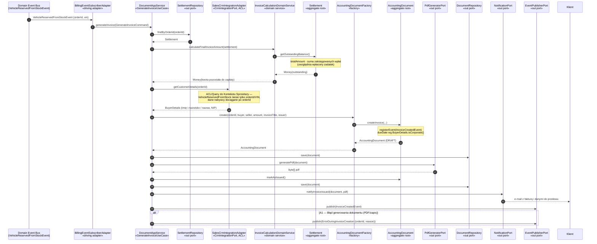

```mermaid
sequenceDiagram
    autonumber
    participant Bus as Domain Event Bus<br/>(VehicleReservedFromStockEvent)
    participant Sub as BillingEventSubscriberAdapter<br/>«driving adapter»
    participant App as DocumentAppService<br/>«GenerateInvoiceUseCase»
    participant SRepo as SettlementRepository<br/>«out port»
    participant Crm as SalesCrmIntegrationAdapter<br/>«CrmIntegrationPort, ACL»
    participant Calc as InvoiceCalculationDomainService<br/>«domain service»
    participant Stl as Settlement<br/>«aggregate root»
    participant Fac as AccountingDocumentFactory<br/>«factory»
    participant Doc as AccountingDocument<br/>«aggregate root»
    participant Pdf as PdfGeneratorPort<br/>«out port»
    participant DRepo as DocumentRepository<br/>«out port»
    participant Notif as NotificationPort<br/>«out port»
    participant Pub as EventPublisherPort<br/>«out port»
    participant Klient

    Bus->>Sub: VehicleReservedFromStockEvent {orderId, vin}
    Sub->>App: generateInvoice(GenerateInvoiceCommand)

    App->>SRepo: findByOrderId(orderId)
    SRepo-->>App: Settlement

    App->>Calc: calculateFinalInvoiceAmount(settlement)
    Calc->>Stl: getOutstandingBalance()
    Note over Stl: totalAmount - suma zaksięgowanych wpłat<br/>(uwzględnia wpłacony zadatek)
    Stl-->>Calc: Money(outstanding)
    Calc-->>App: Money(kwota pozostała do zapłaty)

    App->>Crm: getCustomerDetails(orderId)
    Note over Crm: ACL/Query do Kontekstu Sprzedaży —<br/>VehicleReservedFromStock niesie tylko orderId/VIN,<br/>dane nabywcy dociągane po orderId
    Crm-->>App: BuyerDetails (imię i nazwisko / nazwa, NIP)

    App->>Fac: create(orderId, buyer, seller, amount, invoiceTitle, issuer)
    Fac->>Doc: createInvoice(...)
    Note over Doc: registerEvent(InvoiceCreatedEvent)<br/>dueDate wg BuyerDetails.isCorporate()
    Doc-->>Fac: AccountingDocument (DRAFT)
    Fac-->>App: AccountingDocument

    App->>DRepo: save(document)
    App->>Pdf: generatePdf(document)
    Pdf-->>App: byte[] pdf
    App->>Doc: markAsIssued()
    App->>DRepo: save(document)

    App->>Notif: notifyInvoiceIssued(document, pdf)
    Notif-->>Klient: e-mail z fakturą i danymi do przelewu

    App->>Pub: publish(InvoiceCreatedEvent)

    alt A1 — Błąd generowania dokumentu (PDF/zapis)
        App->>Pub: publish(ErrorDuringInvoiceCreation {orderId, reason})
    end
```
