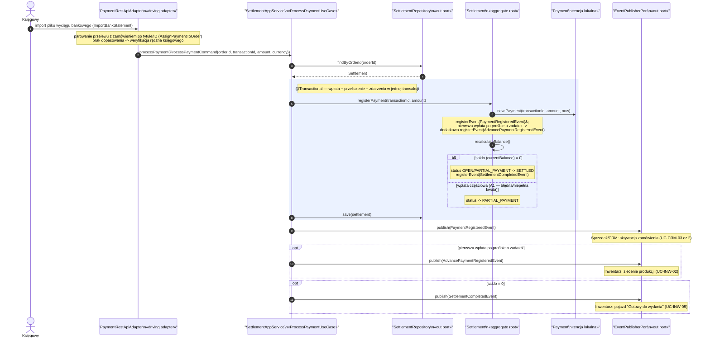

```mermaid
sequenceDiagram
autonumber
actor Ksiegowy as Księgowy
participant Rest as "PaymentRestApiAdapter\n«driving adapter»"
participant App as "SettlementAppService\n«ProcessPaymentUseCase»"
participant SRepo as "SettlementRepository\n«out port»"
participant Stl as "Settlement\n«aggregate root»"
participant Pay as "Payment\n«encja lokalna»"
participant Pub as "EventPublisherPort\n«out port»"

    Ksiegowy->>Rest: import pliku wyciągu bankowego (ImportBankStatement)
    Note over Rest: parowanie przelewu z zamówieniem po tytule/ID (AssignPaymentToOrder)<br/>brak dopasowania -> weryfikacja ręczna księgowego
    Rest->>App: processPayment(ProcessPaymentCommand{orderId, transactionId, amount, currency})

    App->>SRepo: findByOrderId(orderId)
    SRepo-->>App: Settlement

    rect rgb(235,242,255)
    note right of App: @Transactional — wpłata + przeliczenie + zdarzenia w jednej transakcji
    App->>Stl: registerPayment(transactionId, amount)
    Stl->>Pay: new Payment(transactionId, amount, now)
    Note over Stl: registerEvent(PaymentRegisteredEvent)&#59;<br/>pierwsza wpłata po prośbie o zadatek -><br/>dodatkowo registerEvent(AdvancePaymentRegisteredEvent)
    Stl->>Stl: recalculateBalance()
    alt saldo (currentBalance) = 0
        Note over Stl: status OPEN/PARTIAL_PAYMENT -> SETTLED<br/>registerEvent(SettlementCompletedEvent)
    else wpłata częściowa (A1 — błędna/niepełna kwota)
        Note over Stl: status -> PARTIAL_PAYMENT
    end
    App->>SRepo: save(settlement)
    end

    App->>Pub: publish(PaymentRegisteredEvent)
    Note over Pub: Sprzedaż/CRM: aktywacja zamówienia (UC-CRM-03 cz.2)
    opt pierwsza wpłata po prośbie o zadatek
        App->>Pub: publish(AdvancePaymentRegisteredEvent)
        Note over Pub: Inwentarz: zlecenie produkcji (UC-INW-02)
    end
    opt saldo = 0
        App->>Pub: publish(SettlementCompletedEvent)
        Note over Pub: Inwentarz: pojazd "Gotowy do wydania" (UC-INW-05)
    end
```
