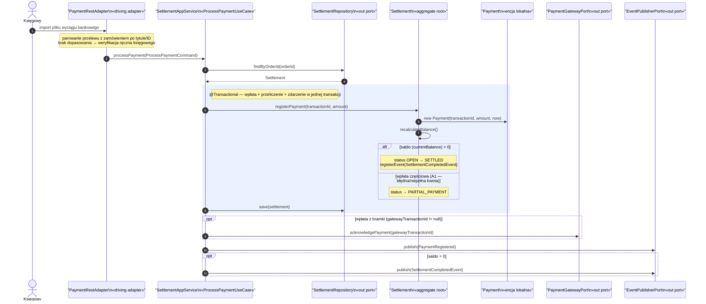

```mermaid
sequenceDiagram
autonumber
actor Ksiegowy as Księgowy
participant Rest as "PaymentRestAdapter\n«driving adapter»"
participant App as "SettlementAppService\n«ProcessPaymentUseCase»"
participant SRepo as "SettlementRepository\n«out port»"
participant Stl as "Settlement\n«aggregate root»"
participant Pay as "Payment\n«encja lokalna»"
participant Gw as "PaymentGatewayPort\n«out port»"
participant Pub as "EventPublisherPort\n«out port»"

    Ksiegowy->>Rest: import pliku wyciągu bankowego
    Note over Rest: parowanie przelewu z zamówieniem po tytule/ID<br/>brak dopasowania → weryfikacja ręczna księgowego
    Rest->>App: processPayment(ProcessPaymentCommand)

    App->>SRepo: findByOrderId(orderId)
    SRepo-->>App: Settlement

    rect rgb(235,242,255)
    note right of App: @Transactional — wpłata + przeliczenie + zdarzenie w jednej transakcji
    App->>Stl: registerPayment(transactionId, amount)
    Stl->>Pay: new Payment(transactionId, amount, now)
    Stl->>Stl: recalculateBalance()
    alt saldo (currentBalance) = 0
        Note over Stl: status OPEN → SETTLED<br/>registerEvent(SettlementCompletedEvent)
    else wpłata częściowa (A1 — błędna/niepełna kwota)
        Note over Stl: status → PARTIAL_PAYMENT
    end
    App->>SRepo: save(settlement)
    end

    opt wpłata z bramki (gatewayTransactionId != null)
        App->>Gw: acknowledgePayment(gatewayTransactionId)
    end

    App->>Pub: publish(PaymentRegistered)
    opt saldo = 0
        App->>Pub: publish(SettlementCompletedEvent)
    end
```